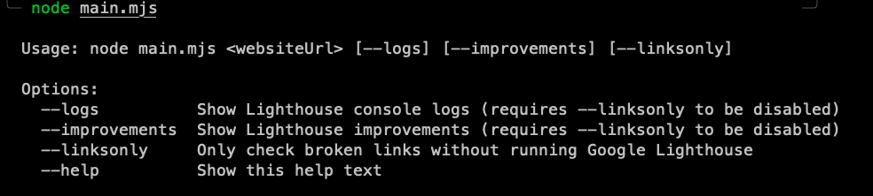

# OptiLink

Hoping to add more commands in the future, but for now this tool can test broken internal and external links on a website as well as perform a google lighthouse report.

<h2>Simple way to check site analytics</h2>

